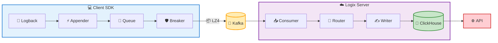
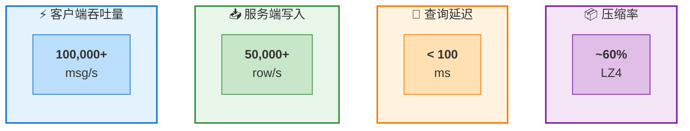
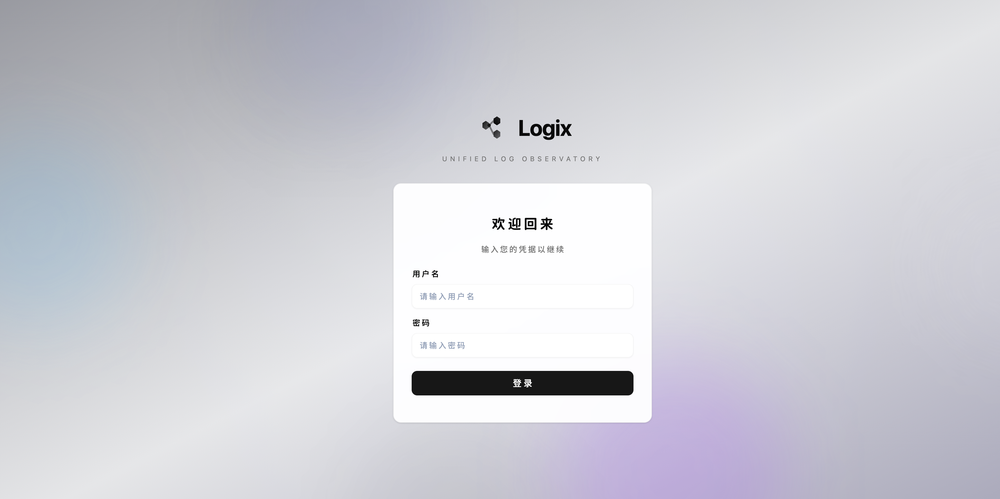
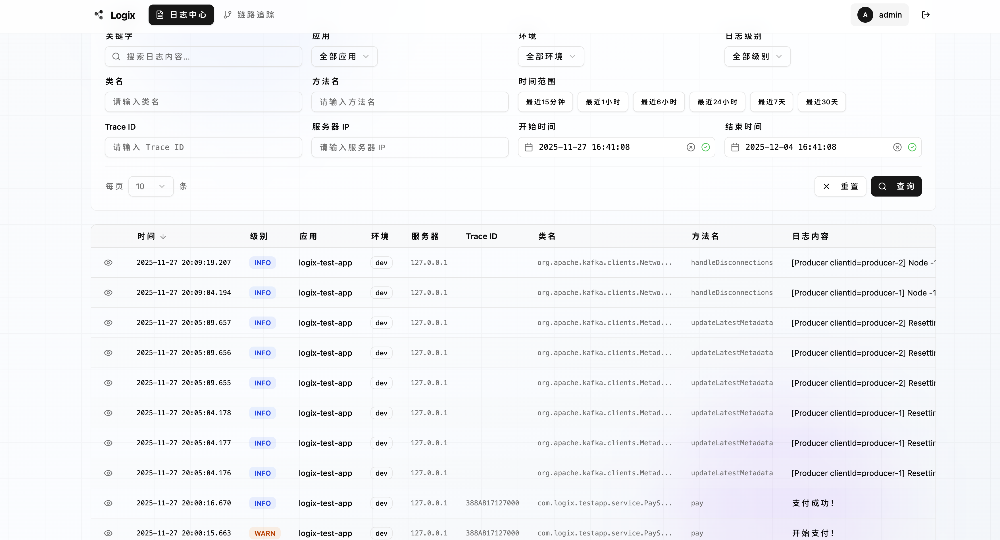
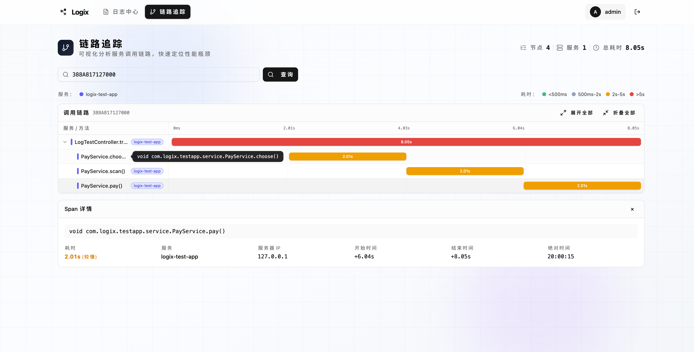
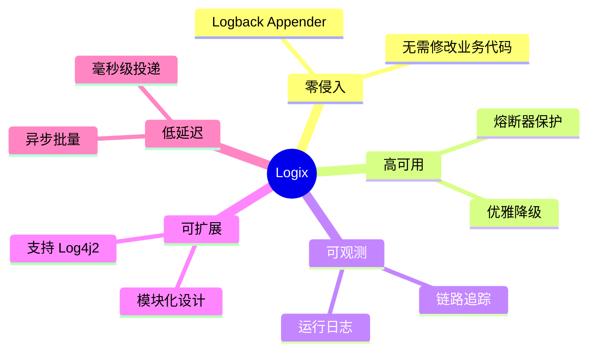

<div align="center">

# Logix

**高性能分布式日志收集与链路追踪系统**

[](https://openjdk.org/)
[](https://spring.io/projects/spring-boot)
[](https://kafka.apache.org/)
[](https://clickhouse.com/)

[系统架构](#-系统架构) • [核心特性](#-核心特性) • [技术栈](#-技术栈) • [性能指标](#-性能指标) • [快速开始](#-快速开始) • [Web控制台](#-web-控制台) • [客户端集成](#-客户端集成)

</div>

---

## 🏗️ 系统架构



---

## ✨ 核心特性

<table>
<tr>
<td width="50%">

### ⚡ 高性能设计

- **异步非阻塞** - 日志写入不阻塞业务线程
- **批量处理** - 客户端/服务端双重批量优化
- **连接池复用** - Kafka Producer 对象池
- **LZ4 压缩** - 减少 60% 网络传输量

</td>
<td width="50%">

### 🔗 分布式链路追踪

- **@Trace 注解** - 方法级自动追踪
- **跨线程传递** - 基于 TTL 上下文传播
- **HTTP 传播** - 自动传递 X-Trace-Id
- **调用树重建** - 服务端自动构建层级

</td>
</tr>
<tr>
<td width="50%">

### 🛡️ 高可用保障

- **熔断保护** - 防止级联故障
- **优雅降级** - 日志丢失不影响业务
- **自动恢复** - 静默期后自动重连

</td>
<td width="50%">

### 💾 存储优化

- **列式存储** - ClickHouse MergeTree
- **按月分区** - 自动生命周期管理
- **180天TTL** - 自动清理过期数据
- **RowBinary** - 二进制协议零开销

</td>
</tr>
</table>

---

## 🛠️ 技术栈

<table>
<tr>
<td align="center"><br/><sub>2.7.18</sub></td>
<td align="center"><br/><sub>3.5.1</sub></td>
<td align="center"><br/><sub>0.7.1</sub></td>
<td align="center"><br/><sub>Redisson 3.23</sub></td>
</tr>
<tr>
<td align="center"><br/><sub>1.2.12</sub></td>
<td align="center"><br/><sub>1.9.19</sub></td>
<td align="center"><br/><sub>2.9.3</sub></td>
<td align="center"><br/><sub>2.14.2</sub></td>
</tr>
</table>

---

## 📊 性能指标



| 指标 | 数值 | 说明 |
|:-----|:-----:|:-----|
| ⚡ 客户端吞吐量 | **100,000+** msg/s | 单实例异步发送能力 |
| 📥 服务端写入 | **50,000+** row/s | ClickHouse 批量写入 |
| 🚀 查询延迟 | **< 100** ms | 百万级数据分页查询 |
| 📦 数据压缩率 | **~60%** | LZ4 网络传输压缩 |

---

## 🚀 快速开始

### 环境要求

| 组件 | 版本要求 |
|:-----|:--------|
| JDK | 8+ |
| Apache Kafka | 3.x |
| ClickHouse | 21.x+ |
| Redis | 6.x+ |

### 1️⃣ 初始化数据库

<details>
<summary>📄 点击展开 ClickHouse 建表语句</summary>

```sql
-- 创建数据库
CREATE DATABASE IF NOT EXISTS logix;

-- 运行日志表
CREATE TABLE IF NOT EXISTS logix.run_logs (
    event_time   DateTime64(3),
    app_name     String,
    env          String,
    server_ip    String,
    seq          UInt64,
    log_level    Enum8('TRACE'=1,'DEBUG'=2,'INFO'=3,'WARN'=4,'ERROR'=5),
    content      String,
    class_name   String,
    method_name  String,
    thread_name  String,
    trace_id     String,
    insert_time  DateTime DEFAULT now()
)
ENGINE = MergeTree
PARTITION BY toYYYYMM(event_time)
ORDER BY (app_name, env, event_time, seq, trace_id)
TTL insert_time + INTERVAL 180 DAY;

-- 追踪日志表
CREATE TABLE IF NOT EXISTS logix.trace_logs (
    event_time   DateTime64(3),
    app_name     String,
    env          String,
    server_ip    String,
    trace_id     String,
    method_name  String,
    position     Enum8('<'=1,'>'=2),
    depth        UInt16,
    insert_time  DateTime DEFAULT now()
)
ENGINE = MergeTree
PARTITION BY toYYYYMM(event_time)
ORDER BY (trace_id, event_time, position)
TTL insert_time + INTERVAL 180 DAY;
```

</details>

### 2️⃣ 启动服务端

```bash
# 编译打包
mvn clean package -pl logix-server -am -DskipTests

# 启动服务
java -jar logix-server/target/logix-server.jar --spring.profiles.active=dev
```

---

## 💻 客户端集成

### Maven 依赖

```xml
<dependency>
    <groupId>com.logix</groupId>
    <artifactId>logix-client-logback</artifactId>
    <version>1.0.0</version>
</dependency>
```

### Logback 配置

```xml
<configuration>
    <!-- Logix Appender -->
    <appender name="LOGIX" class="com.logix.client.logback.LogixAppender">
        <appName>your-app-name</appName>
        <env>dev</env>
        <bootstrapServers>localhost:9092</bootstrapServers>
    </appender>

    <root level="INFO">
        <appender-ref ref="LOGIX"/>
    </root>
</configuration>
```

### 链路追踪

```java
@Service
public class OrderService {

    @Trace  // 自动追踪方法调用
    public Order createOrder(CreateOrderRequest request) {
        // 业务逻辑
        return order;
    }
}
```

### 手动设置 TraceId

```java
// 方式一：通过 MDC
MDC.put("traceId", traceId);

// 方式二：通过 TraceContext
TraceContext.currentTraceID.set(traceId);
```

---

## ⚙️ 配置说明

<details>
<summary>📄 服务端完整配置 (application.yml)</summary>

```yaml
server:
  port: 8480

logix:
  # 认证配置
  auth:
    username: admin
    password: your-secure-password
    session-expiration: 86400

  # Kafka 配置
  kafka:
    bootstrap-servers: kafka1:9092,kafka2:9092
    group-id: logix-server
    max-poll-records: 5000

  # ClickHouse 配置
  clickhouse:
    url: jdbc:clickhouse://clickhouse:8123
    db-name: logix
    username: default
    password:
    connection-timeout: 5s
    socket-timeout: 30s

  # Redis 配置
  redis:
    mode: SINGLE
    database: 0
    connection-pool-size: 64
    single:
      host: redis
      port: 6379

  # 消费管道配置
  pipeline:
    run-log:
      queue-capacity: 10000
      batch-size: 2000
      batch-timeout-ms: 100
    trace-log:
      queue-capacity: 5000
      batch-size: 1000
      batch-timeout-ms: 50
```

</details>

---

## 📡 API 接口

### 日志查询

| 方法 | 路径 | 说明 |
|:-----|:-----|:-----|
| `POST` | `/api/logs/query` | 分页查询日志 |
| `GET` | `/api/logs/apps` | 获取应用列表 |
| `GET` | `/api/logs/envs` | 获取环境列表 |
| `POST` | `/api/logs/poll` | 实时日志拉取 |

### 链路追踪

| 方法 | 路径 | 说明 |
|:-----|:-----|:-----|
| `POST` | `/api/traces/query` | 查询完整调用链 |

<details>
<summary>📝 请求示例</summary>

```bash
# 分页查询
curl -X POST http://localhost:8480/api/logs/query \
  -H "Content-Type: application/json" \
  -d '{
    "appName": "order-service",
    "env": "prod",
    "level": "ERROR",
    "keyword": "timeout",
    "pageNo": 1,
    "pageSize": 20
  }'

# 链路追踪
curl -X POST http://localhost:8480/api/traces/query \
  -H "Content-Type: application/json" \
  -d '{"traceId": "abc123def456"}'
```

</details>

---

## 🖥️ Web 控制台

Logix 提供了基于 **React 19** 的现代化 Web 管理界面，支持实时日志查询和分布式链路追踪可视化。

### 功能展示

<table>
<tr>
<td width="50%">

#### 📋 日志查询

- 多维度筛选（应用/环境/日志级别）
- 关键词全文搜索
- 时间范围选择器
- 分页浏览与实时滚动
- TraceId 快速定位

</td>
<td width="50%">

#### 🌲 链路追踪

- TraceId 完整调用链查询
- 方法调用树可视化
- 调用时序对齐展示
- 调用深度层级标注
- 日志上下文关联

</td>
</tr>
</table>

### 界面预览

<table>
<tr>
<td align="center">

<br/>
<sub><b>🔐 登录页面</b></sub>
</td>
</tr>
<tr>
<td align="center">

<br/>
<sub><b>📋 日志查询 - 多维度筛选与关键词搜索</b></sub>
</td>
</tr>
<tr>
<td align="center">

<br/>
<sub><b>🔗 链路追踪 - 调用树可视化展示</b></sub>
</td>
</tr>
</table>

### 技术栈

| 框架 | 语言 | 构建 | 样式 | UI 组件 |
|:----:|:----:|:----:|:----:|:-------:|
| React 19 | TypeScript 5.9 | Vite 7 | Tailwind 4 | Radix UI |

详细介绍见 [logix-console/README.md](logix-console/README.md)

---

## 📦 模块结构

```
logix/
├── 📁 logix-common                 # 公共组件
│   ├── constants                   # 常量定义
│   ├── enums                       # 枚举类型
│   ├── model                       # 数据模型
│   └── util                        # 工具类
│
├── 📁 logix-client                 # 客户端 SDK
│   ├── 📁 logix-client-core        # 核心组件
│   │   ├── logging                 # 日志分发器
│   │   ├── kafka                   # Kafka 生产者
│   │   ├── trace                   # 链路追踪
│   │   └── circuit                 # 熔断器
│   │
│   └── 📁 logix-client-logback     # Logback 集成
│       ├── LogixAppender           # 自定义 Appender
│       └── LogEventConverter       # 事件转换器
│
└── 📁 logix-server                 # 服务端
    ├── consumer                    # Kafka 消费管道
    ├── storage                     # ClickHouse 存储
    ├── query                       # 查询服务
    ├── controller                  # REST 接口
    └── auth                        # 认证模块
```

---

## 📐 设计原则



---
